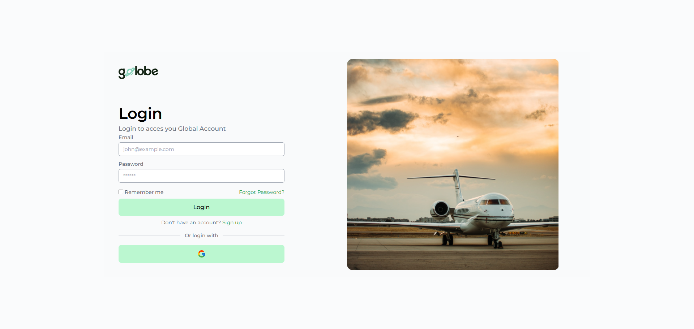
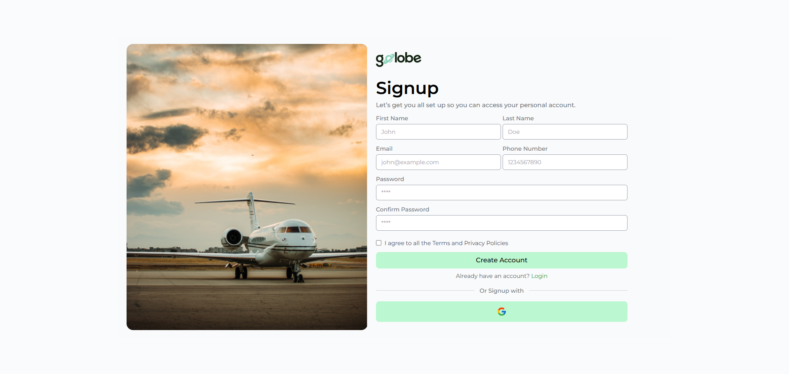
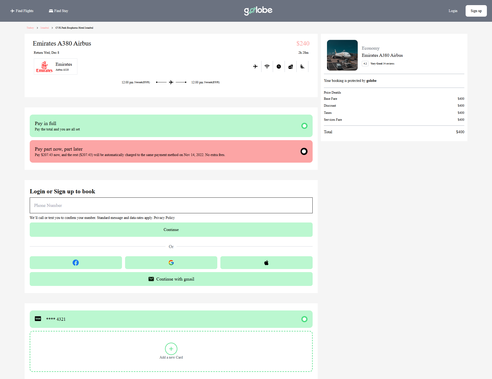
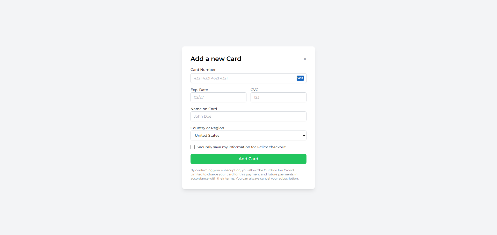

# ✈️ Golobe - Travel Website UI Design


> Below are some UI screens from the Golobe travel website design.







**Golobe** is a modern and responsive travel website UI built with **React** and **Tailwind CSS**. This project focuses purely on front-end design, showcasing elegant layouts for destination browsing, booking, and user login.


## 🌟 Features (UI Only)

- 🏖️ Beautiful Home Page Layout
- 🔍 Destination Search Interface
- 🗓️ Booking Flow Screens
- 🔐 User Login UI
- 🎨 Fully Responsive with Tailwind CSS

---

## 🛠 Tech Stack

- **React**
- **Tailwind CSS**

---

## 🚀 Getting Started

```bash
# Clone the repository
git clone https://github.com/your-username/golobe.git

# Navigate to the project folder
cd golobe

# Install dependencies
npm install

# Start the development server
npm start
